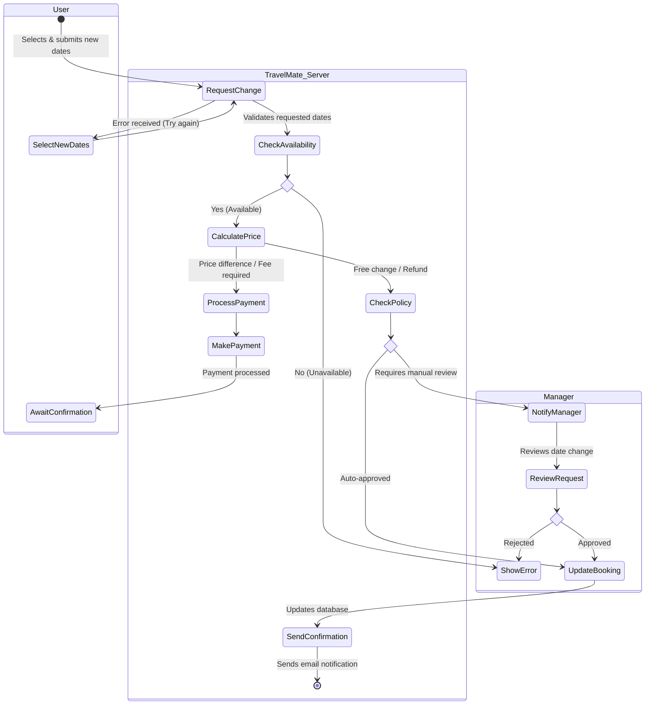

# Feature: [User account]
## Use Case: [Change booking dates]

[The main actors involved in the process are the **User**, the **TravelMate_Server**, and the **Manager**. Throughout the workflow, the server checks the availability of the new dates and calculates any price adjustments, involves the manager for manual approval if necessary, and updates the booking while sending a confirmation to the user.]

