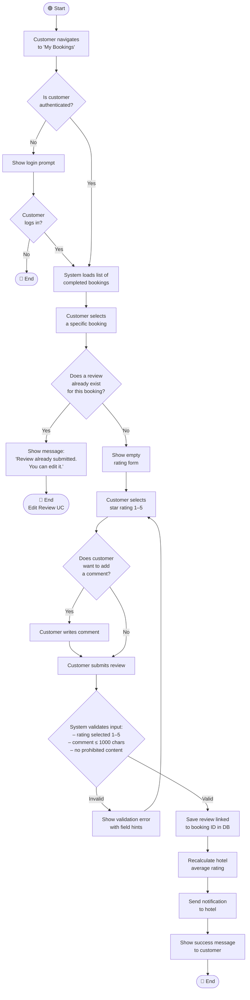

# UML Activity Diagram — Hotel Rating

**Use Case:** Hotel Rating  
**Feature:** Feedback and Star rating
**Primary Actor:** Customer (authorized, visited hotel, has not rated yet)
**Goal:** To rate and/or comment hotel after the visit

---

---

## Use Case Reference

| Field | Value |
|---|---|
| **Use Case Name** | Hotel Rating |
| **Primary Actor** | Customer |
| **Goal** | Submit a new review for a specific completed booking |
| **Pre-conditions** | Customer is authenticated; at least one booking exists with status "completed" |
| **Post-conditions** | Review saved and linked to booking ID; hotel average rating updated; hotel notified |
| **Out of scope** | Editing an existing review → UC "Edit Review" |
| **Main Flow** | Auth → Select booking → Check duplicate → Rating form → Submit → Validate → Save |
| **Alternative Flow** | Not logged in → login prompt → continue or exit |
| **Exception Flows** | Review already exists for booking → redirect to Edit Review UC; Validation fails → retry |
