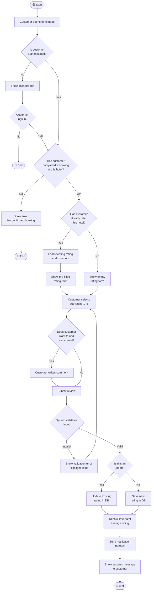

# UML Activity Diagram — Hotel Rating

**Use Case:** Hotel Rating  
**Feature:** Feedback and Star rating
**Primary Actor:** Customer (authorized, visited hotel, has not rated yet)
**Goal:** To rate and/or comment hotel after the visit

---

---

## Use Case Reference

| Field                 | Value                                                               |
| --------------------- | ------------------------------------------------------------------- |
| **Use Case Name**     | Hotel Rating                                                        |
| **Primary Actor**     | Customer                                                            |
| **Goal**              | Rate a visited hotel                                                |
| **Pre-conditions**    | Authorized; completed booking; not rated yet                        |
| **Post-conditions**   | Rating saved; hotel average updated; hotel notified                 |
| **Main Flow**         | Auth check → Booking check → Duplicate check → Form → Submit → Save |
| **Alternative Flows** | Not logged in → login prompt; Already rated → pre-fill form         |
| **Exception Flows**   | No booking → access denied; Validation fail → retry                 |